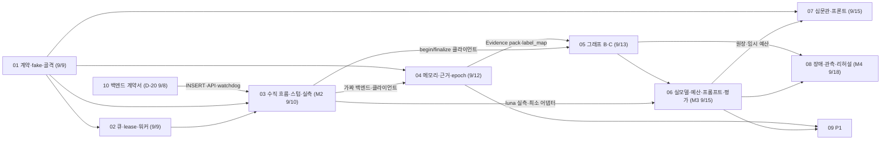

# 📋 떼거지 서비스 에이전트 구현 계획 — 인덱스 및 우선순위 매트릭스

## 1. 개요

- 근거 문서: `docs/proposal/proposal2.md` v2.0(2026-09-07, 통합 확정본 = 확정안 v1.5 + 상세 구조 설계서 v1.1). 보조: `docs/거지방-MVP-기획서.md` v1.1. **둘 다 git 에 없다**(`.gitignore` 가 `docs/plans/` 만 추적) — 그래서 01~10 은 proposal2 없이도 구현할 수 있게 계약·DDL·수치를 옮겨 적었다
- 본 문서는 proposal2 §20 의 **작업 묶음 1~8 + P1 + 백엔드 계약서**로 재편한 인덱스다. 작업 묶음의 날짜·완료 기준·"먼저 실패시킬 케이스"는 §20 과 1:1
- 9/7 밤 사용자 결정 4건: ① proposal2 실행 구조(공유 Postgres + `ai.jobs` 큐 + 워커 + 백엔드 finalize) **그대로**, D-20 전제 ② 문서를 작업 1~8 + P1 로 재편 ③ D-19 = 양형 이유 템플릿 치환 ④ 백엔드 몫은 `10-backend-contract.md` 한 장
- 9/7 저녁 결정 5건 중 폐기: "동기 응답·직접 호출·페이로드 전부". 생존: 별도 서비스(ai-api + ai-worker), 검증은 우리·저장은 백엔드(finalize 가 재검증)

| 지표 | 값 |
|---|---|
| 확정 결정 | 제품·모델 15 + 구현 구조 9(proposal2 §2). 충돌 해소 14건(§3) |
| 미결 | **D-20(9/8)**·D-21·D-22·D-23 신규, D-04·D-07 팀, D-19 팀 확인(계획서 기본값 = 치환) |
| 마감 | 9/9 작업 1·2 · **9/10 M2** 작업 3 · 9/12 작업 4 · 9/13 작업 5 · **9/15 M3** 작업 6·7 · **9/18 M4** 작업 8 · 9/20 동결 |
| 시간 예산 | 유죄 7~8초 · 그 외 5~6초 · 재생성 12~14초(15초) · TEXT_RETRY round 20초 · 심문 4초 |
| 비용 | 건당 약 21원(캐시 17원), 상한 40원 = 27,586 micro-USD. Grok 17원 |
| 코드 현황 | 서기 실측 스크립트 1개. 서기 v5.3 실측 통과. 나머지 0줄. OpenAI 4역할 미실측 |
| 문서 총량 | 계획서 8 + P1 + 계약서 + INDEX = 11. 카드 58장, AI 파트 약 24 인일(§7) |

- 성격 요약: **"설계는 두 겹으로 끝났고 코드는 0줄, 백엔드 의존이 임계 경로다."** 작업 1·2 는 우리 혼자 할 수 있지만 M2(작업 3)부터는 백엔드의 내부 API·watchdog·job INSERT 없이는 한 줄도 시연되지 않는다. D-20 이 9/8 에 안 나오면 9/9 저녁에 하이브리드(동기 전송)로 되돌릴지 다시 묻는다

---

## 2. 우선순위 매트릭스

- 정렬: 중요도(Critical→High→Medium→Low) × 긴급도(즉시 = 9/9, M2 = 9/10, 단기 = 9/13, M3 = 9/15, M4 = 9/18, 이후)
- 난이도: S(≤ 0.5일) / M(1~2일) / L(3일+)

| # | 산출물 · 결정 | 중요도 | 긴급도 | 난이도 | 담당 문서 | 선행 의존성 |
|:--:|---|:--:|:--:|:--:|:--:|---|
| 1 | **D-20 회신** — 공유 Postgres·트랜잭션 안 `ai.jobs` INSERT | Critical | 즉시 | — | 10 §14 | 백엔드 |
| 2 | 계약 JSON Schema 7종·fixture·pydantic·거부 케이스 6종 | Critical | 즉시 | M | 01 | — |
| 3 | ports 5종 + fake provider + domain 4모듈 | Critical | 즉시 | S | 01 | #2 |
| 4 | `ai.jobs` DDL·claim·lease·heartbeat·워커 런타임 | Critical | 즉시 | M | 02 | #1 |
| 5 | reaper SQL·dedupe/priority 규약 | High | 즉시 | S | 02 | #4 |
| 6 | 백엔드 클라이언트(5 API, 멱등 재전송) + 가짜 백엔드 | Critical | M2 | M | 03 | #3 |
| 7 | M2 스텁(SENTENCE → `AI_NOT_READY` 폴백, intake PASS) + 오류 코드 표 채택 | Critical | M2 | S | 03·10 | #4, #6, 백엔드 |
| 8 | 벤더 클라이언트 최소 + luna 실측 3역할 → D-23 판정 | High | M2 | S | 03 | — |
| 9 | 백엔드: begin-generation·finalize·generation-failed·watchdog·job INSERT 2지점 | Critical | M2 | L | 10 §3~§6 | #1 |
| 10 | DDL 002·003 + MemoryPort(참조 recall·retain·delete) | Critical | 9/12 | M | 04 | #4 |
| 11 | `resolve-evidence` 소비 + `build_evidence` + `label_map` + visibility | Critical | 9/12 | M | 04 | 백엔드 §4.2 |
| 12 | privacy epoch 검사·무효화 SQL·늦은 retain 방지·댓글 필터 | High | 9/12 | S | 04 | 백엔드 §8 |
| 13 | 데모 C 메모리 시드 | High | 9/12 | S | 04 | #10 |
| 14 | 그래프 B(9노드, 불변 `trial_prep`) | Critical | 단기 | M | 05 | #11 |
| 15 | 그래프 C(양형·서기 fan-out·검수·보정·finalize·REGENERATE) | Critical | 단기 | L | 05 | #6, #14 |
| 16 | 서버 검증 ⑤ 7항 + `draft_hash` | Critical | 단기 | S | 05 | #3 |
| 17 | 계약 보완 2건(`reason_source`·`texts[].source`) 반영 | High | 단기 | S | 01·05·10 | — |
| 18 | 프롬프트 5종 파일·강도 분리·번들 버전 | High | 단기 | S | 05 | — |
| 19 | 벤더 어댑터 완성·오류 분류·벤더 장애 분리 | Critical | M3 | M | 06 | #8 |
| 20 | 예산·원장(`llm_calls`·`case_budgets`·UNKNOWN)·`node_results` 재사용 | Critical | M3 | M | 06 | #10 |
| 21 | 서기 v6(순한맛·`considering`)·5종 튜닝 | Critical | M3 | M | 06 | #18 |
| 22 | 골든셋 50 + 회귀 평가기 + judge + 정책 v1/v2 | Critical | M3 | M | 06 | #19 |
| 23 | 강도 3종 × 50건 사람 검수 + **D-07 비준** | Critical | M3 | S(+팀 2일) | 06 | #21, #22 |
| 24 | 검수관 재현율 → `MODEL_EVALUATOR_HELL` | High | M3 | S | 06 | #22 |
| 25 | 드립 예시 60 | High | M3 | M(+팀) | 06 | #10 |
| 26 | 심문관 그래프 A·`FINAL_CHECK`·규칙·평가 5세트 | High | M3 | M | 07 | #3 · **덜어내기 1순위** |
| 27 | 백엔드: submissions·공개 API 2개·폴링 API | Critical | M3 | M | 10 §9 | — |
| 28 | 장애 4종 재현 + `TEXT_RETRY` 완성 + UNKNOWN sweep | Critical | M4 | M | 08 | #15, #20 |
| 29 | 관측(로그 필드·지표 9·알림 4·snapshot·trace) | High | M4 | M | 08 | #4, #20 |
| 30 | 짤 힌트 enum·점수 규칙 전달, 시드, 리허설 ×3, runbook, 동결 | Critical | M4 | M | 08 | 전부, 백엔드 §11·§12 |
| 31 | reflect·Hindsight·플래그·모델 실험·잔여 | Low~Medium | 이후 | S~L | 09 | 심사 집계·D-03·D-04 |

---

## 3. Impact / Effort 2×2 배치

### 🟢 Quick Win — 고임팩트 · 저노력(S)
- 계약 파일 7종 + 거부 케이스(01) — 이후 모든 논쟁을 스키마가 끝낸다
- M2 스텁 `AI_NOT_READY` 폴백(03) — watchdog 을 기다리지 않고 템플릿이 2초 안에 뜬다
- luna 실측 3역할(03) — 스크립트 `--provider openai` 확장만
- 서기 v5.3 프롬프트 강도별 4파일 분리 + 동일성 테스트(05)
- 서버 검증 ⑤·lexicon 이식(05) — 스크립트 `validate()` 가 이미 있다
- 데모 C 메모리 시드(04), 가짜 백엔드(03) — 백엔드 없이 우리 테스트가 돈다

### 🔵 Major Project — 고임팩트 · 고노력(M~L)
- `ai.jobs` 큐·lease·워커(02) — 형량 중복 확정 0 의 기반
- 그래프 C(05) — 데모 B·C 의 심장. fan-out·검수·보정·hash·finalize
- 근거 발급 파이프라인(04) — recall 참조 → resolve → label_map. 데모 C 성립 조건
- 예산·원장 + 벤더 어댑터 완성(06)
- 서기 v6 + 골든셋 회귀 + 사람 검수 150 + D-07(06)
- **백엔드 finalize·watchdog·submissions(10)** — 우리 문서가 아니지만 임계 경로

### ⚪ Fill-in — 저임팩트 · 저노력(S)
- reaper SQL·enqueue 스크립트(02), 감정 enum·짤 규칙 문서(08), UNKNOWN sweep(08), 인젝션 규칙·평가 데이터(07)

### 🔴 Thankless — 저임팩트 · 고노력
- Hindsight 어댑터(09, L), reflect(09, M), LangGraph checkpointer(09), Prometheus/Grafana(09), Kubernetes(09) — 데모·심사에 불필요

---

## 4. 문서 맵

| 파일 | 제목 | 마감 | 담당 항목 | 먼저 읽어야 하는 사람 |
|---|---|:--:|---|---|
| `00-INDEX.md` | 매트릭스 · 문서 맵 · 정합성 | — | (본 문서) | 전원 |
| [작업 1 — 계약 · fake provider · 골격](01-contracts-fake-provider.md) | Contracts | 9/9 | #2, #3, #17 | AI 파트 · 백엔드(enum·CaseSnapshot 회신) |
| [작업 2 — `ai.jobs` 큐 · lease · 워커](02-jobs-queue-lease.md) | Queue | 9/9 | #4, #5 | AI 파트 · 백엔드(INSERT 규약·reaper) |
| [작업 3 — 수직 흐름(우리 몫) · 스텁 · 클라이언트 · luna 실측](03-backend-vertical-flow-template.md) | M2 | 9/10 | #6, #7, #8 | AI 파트 · **백엔드**(10 과 함께) · 프론트(폴링) |
| [작업 4 — 메모리 · 근거 · 삭제 epoch](04-memory-evidence-deletion.md) | Evidence | 9/12 | #10~#13 | AI 파트 · 백엔드(resolve-evidence·epoch) · 팀(D-04) |
| [작업 5 — 그래프 B·C](05-graphs-b-c.md) | Graphs | 9/13 | #14~#18 | AI 파트 · 백엔드(finalize 검증·부분 강도) |
| [작업 6 — 실제 모델 · 예산 · 프롬프트 · 평가](06-real-model-budget-prompts-eval.md) | M3 | 9/15 | #19~#25 | AI 파트 · **팀 전원**(검수 3명·D-07) |
| [작업 7 — 심문관 · 프론트](07-intake-frontend.md) | Intake | 9/15 | #26 | AI 파트 · **프론트** · 백엔드(submissions) |
| [작업 8 — 장애 복구 · 관측 · 리허설 · 동결](08-failure-recovery-rehearsal.md) | M4 | 9/18 | #28~#30 | AI 파트 · 백엔드(watchdog·round·시드·짤) · 프론트 |
| [P1 로드맵](09-p1-roadmap.md) | P1 | 10/6~ | #31 | 아키텍트 · 팀 |
| [백엔드 계약서](10-backend-contract.md) | Contract | 9/8~9/17 | #1, #9, #27 + 각 절 | **백엔드 담당 필독** |

---

## 5. Phase 게이트 (proposal2 §20)

### Phase 1 — 9/9 (작업 1·2) 진입 조건
- [x] 사용자 결정 4건(9/7 밤)
- [ ] **D-20 회신(9/8)** — 없으면 작업 2 는 로컬 Postgres 로 진행하되 9/9 저녁 하이브리드 전환 여부 재질문
### Phase 1 완료 판정 기준
- [ ] 스키마 거부 케이스 6종 통과, fixture 12·ports 5·fake 시나리오 8
- [ ] **실제 Postgres 에서 claim 중복 0, 이전 generation 저장 0**

### Phase 2 — M2 9/10 (작업 3) 진입 조건
- [ ] Phase 1 + 백엔드 begin-generation·generation-failed·watchdog·job INSERT 2지점 + submissions 최소(10 §12 표)
### Phase 2 완료 판정 기준
- [ ] **AI 호출 없이 등록 → 투표 → 템플릿 노출, 형량 1회 확정.** 백엔드가 계약대로 이벤트를 쏨
- [ ] luna 3역할 실측·타임아웃 조정·D-23 판정 기록(§8.4)

### Phase 3 — 9/12 (작업 4) 완료 판정 기준
- [ ] 허용된 30일 이력만 집계, 삭제 직후 조회 차단·finalize 거부, 방 누출 0, 늦은 retain 0
- [ ] 백엔드 `resolve-evidence`·`privacy_epochs` 연결, 데모 C 시드

### Phase 4 — 9/13 (작업 5) 완료 판정 기준
- [ ] **마감 30분 방 등록 → 전원 투표 → (fake) AI 판결문 노출.** 호출 횟수·형량 불변·검수 생략 없는 저장 확인
- [ ] 미완이면 **작업 7(심문관)을 뺀다**

### Phase 5 — M3 9/15 (작업 6·7) 완료 판정 기준
- [ ] **강도 3종 × 50건 사람 검수 통과**, 검수관 모델 결정, 드립 60, 기준선 커밋, 벤더 장애 2종 폴백
- [ ] 데모 A(`FINAL_CHECK` 포함), 중복 post 미생성

### Phase 6 — M4 9/18 (작업 8) 완료 판정 기준
- [ ] **형량 중복 확정·삭제 정보 재노출 0건.** 실제 p95·폴백률·누적 비용 기록
- [ ] 리허설 A·B·C ×3, 장애·예산·삭제 시연, runbook, 9/20 동결 태그

### Phase 7 — P1 진입 조건
- [ ] 심사 종료(10/5) + 2주 집계 + D-03·D-04·D-08

---

## 6. 의존성 사슬

- 10(백엔드)이 03·04·05·08 전부의 선행이다 — **우리 문서 8개 중 6개가 백엔드 산출물에 걸린다**
- 05 는 04 없이 `MINIMAL` 조서로 돌 수 있지만 데모 C 는 못 한다. 07 은 어디에도 선행이 아니다(덜어내기 1순위)

---

## 7. 일정 · 부하 (D-08 재산정 자료)

### 작업 ↔ 날짜 ↔ 완료 기준 (proposal2 §20)
| 마감 | 작업 | 완료 기준 | 잔여 리스크 |
|---|---|---|---|
| 9/8~9/9 | 1·2 | 스키마 거부 통과, claim 중복 0 | D-20 미회신 |
| 9/10 M2 | 3 | AI 없이 템플릿 노출·형량 1회 | 백엔드 4개 API + watchdog 하루 |
| 9/11~9/12 | 4 | 30일 집계·삭제 차단 | resolve-evidence 9/11 |
| 9/13 | 5 | fake 로 판결문 노출 | 하루에 3.75 인일 |
| 9/14~9/15 M3 | 6·7 | 사람 검수 150·데모 A | 팀 검수 병렬 2일 |
| 9/16~9/18 M4 | 8 | 중복 확정·재노출 0, 실측 | 백엔드 round·시드·짤 |
| 9/20 | — | 동결 | — |

### AI 파트 부하 (카드 예상 합계)
| 문서 | 인일 | 가용일 |
|---|---:|---|
| 01 | 3.0 | 9/8~9/9 = 2일에 01+02 = **5.25** |
| 02 | 2.25 | |
| 03 | 2.5 | 9/10 = 1일에 **2.5** |
| 04 | 3.0 | 9/11~9/12 = 2일에 **3.0** |
| 05 | 3.75 | 9/13 = 1일에 **3.75** |
| 06 | 4.5(+팀 2~3) | 9/14~9/15 = 2일에 06+07 = **6.25** |
| 07 | 1.75 | |
| 08 | 3.25 | 9/16~9/18 = 3일에 **3.25** |
| **합계** | **24.0** | **11일 → AI 파트 2.2명** |
- 1명이면: 07 전체 보류(스텁 PASS 유지), 06 의 사람 검수·드립 60 은 팀 위임, 04 의 Hindsight 자리·08 의 관측 지표를 최소로. 그래도 **05 는 9/13 하루로 부족** → 04 와 겹쳐 9/11 부터 시작하거나 M3 를 9/16 으로. 이 두 안을 D-08 안건으로
- 백엔드 부하(10 기준, 우리 추정): 내부 API 5개·finalize 12단계·watchdog·round·무효화·submissions·공개 API 2개·폴링·시드·짤 ≈ **7~9 인일**, 대부분 9/10~9/13

### 시간·비용 예산 (proposal2 §5.4·§14.3, 실측 반영 자리)
| 경로 | 호출 | 예상 | 실측(08 기록) |
|---|---|---:|---:|
| 유죄 | 양형관 + 서기(병렬) + 검수 | 7~8초 | |
| 무죄·동의·기각 | 서기(병렬) + 검수 | 5~6초 | |
| 조서 미완 | + 인라인 조서 | +2초 | |
| 검수 실패 재생성 | + 서기 + 검수 | 12~14초 | |
| TEXT_RETRY round | 서기 + 검수 | ≤ 20초 | |

| 호출 | 모델 | 단가 |
|---|---|---:|
| 심문관 | luna | 0.5원(보완 0.7원) |
| 조서 · 드립 후보 | luna · grok-4.20 | 1.1원 · 4.2원 |
| 양형관(유죄만) | luna | 0.8원 |
| 서기(강도별 병렬, 실측) | grok-4.20 | 13.0원(캐시 8.7원) |
| 검수 | luna(terra 12.2원) | 1.2원 |
| **판결 1건** | | **약 21원**, 재생성 +14원, cap 40원 |

---

## 8. 코디네이터 정합성 정리

> 계획서를 proposal2 에서 재편하며 생긴 소유·보완·정정 사항. 각 문서를 실행하기 전에 이 절을 먼저 읽을 것.

### 8.1 마이그레이션 채번
| 번호 | 파일 | 소유 | 시점 | 내용 |
|---|---|---|:--:|---|
| `001` | `001_ai_jobs.sql` | AI(02) | 9/9 | `ai` 스키마·`jobs`·grants |
| `002` | `002_preparation_evidence.sql` | AI(04) | 9/11 | `trial_prep`·`dossiers`·`evidence`·`evidence_sources`·`banter_examples` |
| `003` | `003_memory_call_ledger.sql` | AI(04) | 9/11 | `memory_facts`·`processed_memory_events`·`case_budgets`·`llm_calls`·`node_results` |
| `004` | `004_verdict_generation.sql` | **백엔드**(10 §2) | 9/10 | 업무 테이블 변경 + `privacy_epochs`·`verdict_commit_records`·`text_evidence_refs` |
| `005` | `005_memory_summaries.sql` | AI(09) | P1 | reflect |
- AI 러너는 001~003 만 적용. 004 초안은 AI 저장소에 두고 백엔드 저장소로 이관

### 8.2 문서 간 소유 정리
| 항목 | 소유 | 소비 | 비고 |
|---|---|---|---|
| `contracts/*.schema.json` 7종 + fixture | 01 | 전부 | 변경 시 01 로 돌아가 `schema_version` |
| `domain/lexicon.py`·`intensity.py`·`attack_angles.py` | 01 | 04·05·06 | 단일 정의 |
| `domain/validation.py` | 01(구조) → **05(텍스트 규칙)** | 06 회귀 | |
| ports 5종 | 01 | adapters(02·03·04·06) | |
| 가짜 백엔드 `tests/fakes/backend_app.py` | 03 | 04·05·08 | 실제 백엔드 대조는 시연에서 |
| `openai_compat_llm.py` | 03(최소) → **06(완성)** | 05 | |
| 프롬프트 파일 | 05(초안) → **06(소유)** | 그래프 | 06 이후 변경은 회귀 뒤에서만 |
| `templates-v1.json` | 01 | 03·05·**백엔드 watchdog** | 백엔드 복사·버전 고정 |
| reaper·무효화 SQL | 02·04 | **백엔드 스케줄러 실행** | |
| 짤 점수 | **백엔드 finalize**(10 §11) | 08 규칙 제공 | 우리는 `meme_tag`·`hints` 만 |
| 재시도 | **백엔드 round 예약** | 05 REGENERATE·08 | 우리 쪽 스케줄러 없음 |

### 8.3 proposal2 v2.0 보완·정정 — 계획서 작성 중 발견 (proposal2 갱신 대기)
| 위치 | proposal2 | 보완·정정 | 문서 |
|---|---|---|---|
| §9.2 `generation-failed` | `error_code` 만 언급, 코드 표 없음 | 코드 표(재시도 없음 3종 / round 예약 5종) 신설. M2 스텁은 `AI_NOT_READY` | 03 §1, 10 §4.6 |
| §5.2 조회 6종 | `get_room_rules`·`get_defendant_stats` 원본 "RDBMS" | 워커는 업무 테이블을 못 읽으므로 **`resolve-evidence` 응답에 방 규칙·집계·최근 판결·승인 댓글** 포함 | 04 §3.4, 10 §4.2 |
| §9.2 snapshot | 사건·평결만 | RETAIN job 용 `verdict_final`·`comment` 확장 `(제안)` | 04, 10 §4.1 |
| §6.3 `SentencingDecision` | `reason_source` 없음 | D-19 치환을 finalize 에 전달하려면 `reason_source ∈ AI|TEMPLATE` 필요 | 01, 05, 10 §5 |
| §6.3 `TextDraft` · §15 "일부 강도만 실패" | 강도별 `source` 없음 | `TextDraft.source ∈ AI|TEMPLATE` + `TEXT_RETRY payload.intensities[]` `(제안)` | 01, 05, 10 §5·§7 |
| §7.4 제출 임시 예산 | "등록 시 사건 예산으로 이전" | 이전하려면 제출→게시물 매핑 통지가 필요 `(제안)` | 06 §3.2, 10 §4.4 |
| 부록 B 데모 C "관측 화면" | 주체 미정 | AI API `trace` 엔드포인트 + 백엔드 프록시 `(제안)` | 08 §3.3, 10 §4.5 |
| §19 경로 | `services/ai/…` | 이 저장소 루트 = `services/ai/`. 모노레포가 아니면 접두 없이 | 01 |
| §17 짤 "서버가 고른다" | 주체 모호 | **백엔드 finalize** 10 단계에서 | 08, 10 §11 |
| §7.4 UNKNOWN | "예약액을 바로 환급하지 않는다" 만 | 24h 뒤 보수적 확정 sweep 신설 | 06, 08 §3.2 |
| §6.2 `dismissed` | 각하는 job 없음 | §3 규약에 명시 + 시나리오 B 는 `disagree` | 05, 10 §3 |

### 8.4 실행 전 결정이 필요한 사항 (팀 · 제품 오너 · 백엔드)
- [x] **D-20 공유 Postgres** — 9/8 확정: Supabase 인스턴스 공유(10 §15.2). 서버에 재판 흐름 없음 → 10 §2~§9 전부 신규
- [x] **D-21 enum** — 9/8 확정: 프론트 값 표준(`mild/spicy/hell` 등), 카테고리 11종 고정(10 §15.2). 01 교체는 CT-07
- [x] **연동·전달·모델** — 9/8 확정: 하이브리드(판결 큐 + 서버 AiClient 3종 동기), 폴링(Realtime·SSE 없음), Grok + OpenAI 유지(10 §15.2)
- [x] **D-07** — 9/8 확정: `guardrail-v2` 로 시작(10 §15.3). 팀 비준은 M3 검수 시, 미비준이면 `guardrail-v1`
- [x] **D-19** — 9/8 확정으로 닫음(팀 확인 불필요)
- [x] **D-22** — 9/8 확정: 8 로 시작, 429 시 하향
- [ ] **D-23 양형관 실측 > 2초 대응** — 작업 3 실측 결과 기록 자리: sentencing p90 ____초 → 유지 / 밴드별 사전 후보(09 G-8)
- [x] **D-04** — 9/8 확정: P0 제외, `ROOM_COMMENT_STYLE_ENABLED=false` 유지, retain 은 한다(09 C)
- [ ] **검수관 모델** — 작업 6 재현율 기록 자리: 지옥맛 recall ____ → luna / terra
- [ ] `generation-failed` 오류 코드 표·`reason_source`·`texts[].source`·`intensities[]`·매핑 통지·trace 프록시(백엔드 채택, 10 §14)
- [x] 배포 구조 — 9/8 확정: 백엔드 관리 EC2 1대 + Docker Compose, 우리는 이미지 2개·compose 조각만(10 §15.2)
- [x] xAI·OpenAI 키·결제 — 9/8 확정: AI 파트 개인 계정 발급·결제, 팀 정산(10 §15.3)
- [ ] 알림 채널·비용 임계, LangSmith·CI 실비
- [ ] 드립 라벨링 담당·검수 인력 3명·짤 제작 담당(10~15장)·감정 어휘 6종
- [x] **D-08** — 9/8 확정: AI 파트 2명, 일정 그대로(07 보류·05 조기 착수·M3 이동 없음)
- [ ] 서버 `AiClient` 3종(상 이름·도전 서술·순찰 문구) 동기 엔드포인트 — 9/8 결정 **P1**(09 H)

### 8.5 문서에 배정되지 않은 항목 (의도적 제외)
| 항목 | 사유 |
|---|---|
| 짤 이미지 제작·CDN·CORS·공유 카드 캔버스 | 팀·백엔드·프론트. 우리는 `meme_tag`·`hints` |
| 외부 밈·선화 재작화·수집기·Metadata Agent | proposal2 §17 범위 밖, D-09 |
| 기획서 본문 갱신(proposal2 §21 "문서" 행) | 문서 작업 |
| Web Push·알림 문구, 거지력·티어·형 집행 | 백엔드·프론트. 09 G-6 가 페이로드 연동만 |
| Hindsight 자체 운영·과금 | 09 + D-03 |
| 카카오 로그인·PWA·배포 인프라 | 타 파트 |
