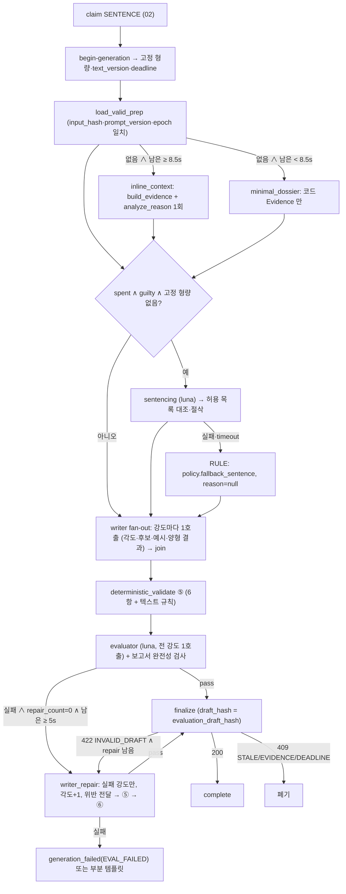

# 🛠️ [Tech Spec] 기술 명세서: 작업 5 — 그래프 B·C (fake model) · 서기 병렬 fan-out/join · 서버 검증 · 검수·보정 · draft hash · finalize (9/13)

> 근거: proposal2 §3 #2(양형관+서기)·#3(call_index=강도 슬롯)·#4(양형 이유 불변, D-19)·#9(disagree≠dismissed)·#12(재생성 15초), §5.2·§5.3(노드 흐름·⑤ 서버 검증·⑥ 검수관·⑦ finalize·입력 최소화 표), §6.3 타입, §10.1 FinalizeRequest, §13 프롬프트 자산, §14.1 예산 설정·토큰 상한, §15 실패 처리(일부 강도 실패 신규), §20 작업 5 + 먼저 실패시킬 케이스(Banter 실패해도 조서 사용 · prep 없을 때 최소 조서 · 검수 실패 2회 후 템플릿 · 강도 일부 누락 · 서기 병렬 중 1개만 실패).
> **선행 문서: 01~04.** 이 작업은 **fake provider** 로 돈다. 실제 모델·예산·원장은 작업 6. 완료 기준(proposal2 §20): 마감 30분 방에서 등록 → 전원 투표 → AI 판결문 노출. **모델 호출 횟수·형량 불변·검수 생략 없는 저장** 확인.
> 계약 보완 2건을 이 문서가 제안한다(`00-INDEX.md` §8.3): `SentencingDecision.reason_source ∈ AI|TEMPLATE`(D-19 치환을 finalize 에 전달), `TextDraft.source ∈ AI|TEMPLATE`(일부 강도 실패 저장). 둘 다 01 CT-03 에서 스키마에 추가한다(`schema_version` 유지, 필수 필드 추가는 M2 전이라 허용).

## 1. 개요 및 구현 목표

### 목적:
- **그래프 B(사전 준비)**: `load_case → recall_candidates → resolve_sources → build_db_evidence → analyze_reason(LLM) → persist_dossier → generate_banter(LLM, 강도별) → validate_banter → persist_banter`. 모델 호출은 조서·드립 후보 둘뿐. 조서 저장에 성공하면 `DOSSIER_READY`, 드립까지 되면 `COMPLETE`. **드립 실패가 조서를 되돌리지 않는다**
- **그래프 C(선고)**: `begin_generation → load_valid_prep → [missing: minimal_dossier / inline_context] → sentencing(guilty only) → writer(fan-out by intensity) → join → deterministic_validate → evaluator → [repair ≤ 1] → finalize | generation_failed`. **보정 루프는 `repair_count <= 1` 코드 state 로만 제한**, 최초 draft 와 보정 draft 의 검수 결과·hash 를 섞지 않는다
- **형량은 한 번**: 양형관 출력은 허용 목록과 대조·절삭 후 `begin-generation` 이 준 고정값이 있으면 그것을 쓴다. 재생성·TEXT_RETRY 는 `texts` 만. 양형 이유가 검수에 걸리면 **재생성하지 않고 템플릿 치환**(D-19)
- **검수 없이는 저장하지 않는다**: LLM 의 `pass` 를 믿지 않고 보고서 완전성을 코드가 검사, `draft_hash` 로 검수 대상과 finalize payload 를 묶는다
- **예산**: DB 가 준 `deadline_at` 을 monotonic 으로 바꿔 노드 timeout = `min(노드 상한, 남은 시간 − 다음 필수 단계 예약)`. **검수 시간을 확보할 수 없으면 새 서기 호출을 시작하지 않는다**

### 핵심 플로우:

- `disagree`(살까 말까 부결)는 정상 생성 경로에서 양형관만 건너뛴다. `dismissed`(정족수 미달)는 job 자체가 없다(§3 #9)
- `TEXT_RETRY` 는 같은 그래프를 `mode=REGENERATE` 로: `begin-generation` 이 준 고정 형량·이유, 예산 20초, **round 안 보정 없음**, 실패는 다음 round(백엔드)

### 현상태
- 작업 1~4 산출물(계약·큐·가짜 백엔드·근거 발급) 위에서 fake provider 로 돈다. 서기 v5.3 프롬프트는 실측 통과분을 그대로 옮긴다

## 2. 작업 범위 (Scope Boundary)

### In-Scope
| # | 항목 | 등급 | 난이도 |
|---|---|:--:|:--:|
| 3.1 | `graphs/states.py`·`domain/budget.py` — state 2종, monotonic deadline, 노드 timeout 계산 | High | S |
| 3.2 | 그래프 B `graphs/preparation.py` + `application/prepare_case.py` — 9노드, `trial_prep` 상태 전이·불변 행 | Critical | M |
| 3.3 | 그래프 C `graphs/sentencing.py` + `application/sentence_case.py` — 양형관·서기 fan-out/join·검수·보정·finalize·`mode=REGENERATE` | Critical | L |
| 3.4 | 서버 검증 ⑤ `domain/validation.py` 텍스트 규칙 + `domain/draft_hash.py` | Critical | S |
| 3.5 | 프롬프트 초안 5종(`context-v1`·`banter-v1`·`sentencing-v1`·`writer/*-v5.3` 분리·`evaluator/guardrail-v1/v2`) | High | S |
| 3.6 | `domain/dossier_rules.py`(카테고리 키워드 사전)·`domain/retries.py` 골격(오류 → 폴백 분기) | Medium | S |
| 3.7 | 통합 테스트(fake + 가짜 백엔드 + 실제 Postgres) — 먼저 실패시킬 케이스 5종 | Critical | M |

### Out-of-Scope
- 실제 벤더 호출·예산 예약·`llm_calls`·`node_results` 재사용·429 백오프(작업 6). 작업 5 는 `LedgerPort` 를 no-op 으로 주입
- 프롬프트 **튜닝**·순한맛·`considering` 확장·골든셋(작업 6). 작업 5 의 프롬프트는 fake 가 무시하는 초안이지만 파일·버전·섹션 분리 구조는 여기서 고정
- 짤 선택(백엔드 finalize, 10 §11). 서기는 `meme_tag`·`meme_hints` 까지
- watchdog·TEXT_RETRY round 예약(백엔드)

### 다른 파트에 요청 (백엔드·프론트)
| 대상 | 요청 | 기한 |
|---|---|---|
| 백엔드 | `finalize` 의 결정적 검증 재실행(hash·버전·강도 집합·라벨→UUID·길이)과 `reason_source`·`texts[].source` 저장(10 §5). 일부 강도 `TEMPLATE` 이면 `TEXT_RETRY` round 를 **그 강도만** 예약(payload `intensities[]`) `(제안)` | 9/13 |
| 백엔드 | `begin-generation` 응답에 `fixed_sentencing{sentence, sentencing_reason, reason_source} | null`, `text_version`, `deadline_at`(SENTENCE 는 confirmed+10s, TEXT_RETRY 는 round+20s) | 9/13 |
| 프론트 | 강도별 텍스트는 방 컨텍스트 강도 행, 없으면 `default_intensity` 행. `source=TEMPLATE` 이면 AI 판사 라벨·양형 이유 블록 숨김 | 9/13 |

### 팀 결정 대기
- D-19(치환) — 이 문서는 사용자 결정(9/7 밤)대로 템플릿 치환을 구현한다. 팀 확인은 병행
- D-22 동시성 8 — 서기 fan-out 이 강도 수만큼 동시 호출하므로 SENTENCE 슬롯 2 × 최대 3강도 = 6 이 상한 안에 들어야 한다

## 3. 기술 상세 설계 (Technical Design)

### 3.1 state · 예산 (`graphs/states.py`·`domain/budget.py`)
```python
class PrepareState(TypedDict):
    job: Job; snapshot: CaseSnapshot; candidates: list[MemoryCandidate]; resolved: ResolveEvidenceResponse | None
    evidence: list[Evidence]; label_map: dict[str, str]; dossier_id: str | None
    reason_analysis: dict | None; banter: dict[Intensity, list[Candidate]]; status: str; errors: list[str]

class SentenceState(TypedDict):
    job: Job; mode: Literal["INITIAL", "REGENERATE"]; snapshot: CaseSnapshot; begin: BeginGenerationResult
    deadline: Deadline; dossier: Dossier | None; dossier_source: Literal["PREP", "INLINE", "MINIMAL"]
    banter: dict[Intensity, list[Candidate]]; sentencing: SentencingDecision | None; sentencing_source: Literal["AI", "RULE", "FIXED"]
    drafts: dict[Intensity, TextDraft]; draft_sources: dict[Intensity, Literal["AI", "TEMPLATE"]]
    validation: dict[Intensity, list[str]]; evaluation: EvaluationReport | None
    repair_count: int; draft_hash: str | None; calls: list[CallRecord]; failure: str | None
```
- `Deadline.from_db(deadline_at, db_now)`: DB 시간과 로컬 monotonic 의 차이로 남은 시간을 만든다. 호스트 clock 을 신뢰하지 않는다(§14.1)
- `node_timeout(name)` = `min(NODE_TIMEOUT[name], remaining − reserve_after(name))`. `reserve_after`: writer 뒤 evaluator 4s + finalize 0.5s, evaluator 뒤 finalize 0.5s. 계산 결과 ≤ 0 이면 그 노드를 **시작하지 않고** 폴백
- 429 백오프가 남은 시간을 넘으면 즉시 폴백(작업 6 `retries.py` 가 결정, 작업 5 는 훅만)

### 3.2 그래프 B (`graphs/preparation.py`, proposal2 §5.2)
| 노드 | 동작 | 실패 시 |
|---|---|---|
| `load_case` | `backend.snapshot(job)` → `CaseSnapshot`. `post_version`·`audience_version` 이 job payload 와 다르면 job 종료(구버전 이벤트) | fail(BACKEND_UNAVAILABLE) 재시도 |
| `recall_candidates` | `memory.recall_user(author, category, before=created_at, limit=20)` + `recall_room(각 방)`. 0.5초 `wait_for` | 빈 후보로 계속 |
| `resolve_sources` | `backend.resolve_evidence(job, {candidates, include: [rules, aggregates, recent_verdicts, style_comments if flag]})` | 빈 응답으로 계속(코드 F0·AGGREGATE 없음 → F0 만) |
| `build_db_evidence` | 04 `build_evidence` → pack ≤ 12, `label_map` | — |
| `analyze_reason` | LLM(조서, luna): 입력 = 사건·코드 사실(라벨)·사유 원문. 출력 `facts[]{kind, text, source_refs}` + `reason_analysis`. **`source_refs ⊆ 입력 라벨`** 아닌 fact 삭제. 살아남은 fact 는 `MODEL_INFERENCE` Evidence 로 `F{n}` 이어 붙임(`RULE_HIT`·`MITIGATION`·`REASON_ANALYSIS` 만 허용) | 코드 Evidence 만으로 계속(§5.2) |
| `persist_dossier` | epoch 재확인 → `ai.dossiers`+`ai.evidence`+`ai.trial_prep(status=DOSSIER_READY, input_hash, prompt_version)` 한 트랜잭션. 같은 `(post_id, input_hash, prompt_version)` 이 이미 `COMPLETE` 면 **새로 쓰지 않고 종료**(불변) | fail |
| `generate_banter` | 강도마다 1호출(Grok): 입력 = 허용 Evidence(라벨), 사건 타입, 강도, 승인 예시 ≤ 3(`ai.banter_examples approved=true`), 말투 예시(플래그). 출력 후보 3~5, `fits` 양쪽 계열 | 그 강도 후보 없음 |
| `validate_banter` | `REPEAT_OFFENSE`·`ROOM_RULE_CALLBACK` 인데 `evidence_labels` 비면 삭제, 없는 라벨 삭제, `DEATH_WORDS` 삭제, `mild`·`spicy` 에 `PROFANITY` 삭제 | — |
| `persist_banter` | `trial_prep.banter_json` 최초 1회 채움 → `COMPLETE` | `DOSSIER_READY` 유지 |
`input_hash` = sha256(canonical(snapshot 의 post·audience·room_snapshots·privacy_versions·intake_result)). 프롬프트 버전이 바뀌면 새 행.

### 3.3 그래프 C (`graphs/sentencing.py`, proposal2 §5.3)
| 노드 | 동작 |
|---|---|
| `begin_generation` | `backend.begin_generation(verdict_id, job, generation, verdict_version)` → 고정 형량(있으면 `sentencing_source=FIXED`)·`text_version`·`deadline_at`. 409 → 폐기·complete |
| `load_valid_prep` | `trial_prep` 중 `post_id` 일치 ∧ `input_hash` 일치(스냅샷 재계산) ∧ `prompt_version` 일치 ∧ `invalidated_at IS NULL` ∧ dossier `privacy_versions` == 스냅샷. 없으면 남은 시간 ≥ `INLINE_CONTEXT_MIN_REMAINING_MS` 면 `inline_context`(04 build + 조서 1회, 드립 생략), 아니면 `minimal_dossier`(코드 Evidence 만) |
| `sentencing` | `spent ∧ guilty ∧ FIXED 아님` 만. 입력: jury snapshot·허용 목록(`code, rank`)·Evidence pack·걸린 RULE. **방 말투 예시 없음.** 출력 `sentence` ∉ 허용 목록 → `rank` 최대(상한)로 절삭 + 감사 로그. timeout·오류 → `policy.fallback_sentence`, `reason=null`, `sentencing_source=RULE`. `sentencing_reason` > 100자 → **검수 실패로 취급하지 않고 즉시 템플릿 치환**(D-19, `reason_source=TEMPLATE`) |
| `writer` (fan-out) | 강도마다 `asyncio.create_task`(세마포어 8 안): 입력 = 양형 결과(인용·수정 금지), Evidence(라벨), 그 강도 후보(`fits ∋ result`), 그 강도 말투 예시(플래그), `attack_angle = angles.pick(post_id, offset)`, **그 강도 섹션만의 시스템 프롬프트**. 출력 `TextDraft` 1개 + `meme_tag`·`meme_hints`(`default_intensity` 호출 값 채택). 실패 강도는 `draft_sources[i]=TEMPLATE`(`templates-v1.json`) |
| `join` | 강도 집합 == `target_intensities` 확인. 전부 실패 → `generation_failed(VENDOR_UNAVAILABLE)` |
| `deterministic_validate` | §3.4 |
| `evaluator` | 전 강도 초안 1호출(luna; `hell` 포함 ∧ `MODEL_EVALUATOR_HELL≠MODEL_JUDGMENT` 면 `hell` 만 별도 호출). 입력: 최종 draft·Evidence(라벨→텍스트)·jury·형량·정책 버전·검사표. `validate_evaluation` 통과 못 하면 검수 실패. `sentencing_reason_check` 실패 → **템플릿 치환 후 재검수 없이 진행**(D-19, 문구 검수는 별개) |
| `writer_repair` | `repair_count==0 ∧ 남은 ≥ 5s`: 실패 강도만 각도 +1, 위반·문제 문장을 "피할 것" 으로 전달, 양형·조서 고정 → ⑤ → ⑥(실패 강도만). 실패 → 그 강도 `TEMPLATE` |
| `finalize` | `FinalizeRequest` 조립(§3.5) → 200 → `complete`. 409 → 폐기. 422 → repair 남았으면 1회, 아니면 `generation_failed(SCHEMA_INVALID)` |
| `generation_failed` | 오류 코드 표(03 §1). 전 강도 실패·검수관 오류·예산 초과 → `VENDOR_UNAVAILABLE`/`EVAL_FAILED`/`DEADLINE_EXCEEDED` |
- **입력 최소화 표(proposal2 §5.3)**를 노드별 `build_messages` 에 그대로 코드로: 조서에 평결·형량 추정 없음, 양형관에 말투 예시 없음, 서기에 다른 강도 예시·형량 변경 통로 없음, 검수관에 페르소나·메모리 도구 없음
- 모든 노드는 입력 문자열의 명령을 업무 지시로 승격하지 않는다. `kind=opinion` 이어도 의미 검사 생략 없음

### 3.4 서버 검증 ⑤ (`domain/validation.py` 텍스트 규칙, proposal2 §5.3 ⑤ + 실측 규칙)
| # | 검사 | 처리 |
|---|---|---|
| 1 | `kind=fact|claim` 인데 `evidence_labels` 비었거나 `label_map` 에 없음 | **문장 삭제.** 남은 문장 < 1 → 검수 실패(`UNGROUNDED_CLAIM`) |
| 2 | 본문에 `F\d+` 문자열 | **문장째 삭제**(2문장 이상 남을 때), 모자라면 ID 만 제거. headline 도 제거 |
| 3 | headline > 30 · statement 합산 > 200 · 문장 수 ∉ 2~4 | 검수 실패(`SCHEMA_INVALID`) |
| 4 | `meme_tag` 가 평결·형량과 모순 | 교정(`guilty`+최고 rank → `GUILTY_HEAVY`, 그 외 유죄 `GUILTY_LIGHT`, 나머지 동명) |
| 5 | 강도 집합 ≠ `target_intensities`, 중복 | 검수 실패 — join 에서 이미 걸러지지만 재확인 |
| 6 | `mild`·`spicy` 에 `PROFANITY` / 전 강도 `DEATH_WORDS` / `hell` 목록 밖 욕·같은 욕 2회·`새끼`·`ㅋㅋ` 2회 | 검수 실패(`PROFANITY_OUT_OF_LIST` / `SELF_HARM_LEXICON`) — **서버가 먼저 거르고** 검수관이 변형을 잡는다 |
| 7 | `mild` 반말 의심(어미 휴리스틱), 이모지·U+FFFD, `WORN_PHRASES` | 검수 실패(`INTENSITY_MISMATCH`) |
- 삭제 후 `statement` 재조립, `text_evidence_refs` 후보(라벨→UUID) 생성. **라벨이 map 에 없으면 근거 없는 사실 문장**(§6.4)
- `domain/draft_hash.py`: `canonical(draft, sentencing)` = 키 정렬·공백 없음·NFC 정규화 JSON → sha256. 검수 직전 계산한 `draft_hash` 와 finalize 의 `evaluation_draft_hash` 가 같아야 한다. **검수 뒤에 문구를 고치면 hash 가 바뀌어 finalize 가 거부한다** — 그래서 ⑤ 는 ⑥ 앞에서만 돈다

### 3.5 finalize 조립 (`FinalizeRequest`, proposal2 §10.1)
`job_id`·`generation_id`·`verdict_version`·`expected_text_version`(begin 응답)·`dossier_id`·`privacy_versions`(스냅샷)·`draft_hash`·`sentencing`(FIXED/AI/RULE 값 + `reason_source`)·`draft`(texts + `source`)·`evaluation`·`evaluation_draft_hash`·`prompt_bundle_version`·`guardrail_policy_version`·`model_ids{sentencing, writer, evaluator}`. finalize 직전 epoch 재확인(04 §3.5). 응답 유실 → 같은 본문 재전송(03 §3.2)

### 3.6 프롬프트 초안 (`prompts/`, proposal2 §13·§19)
| 파일 | 내용 |
|---|---|
| `writer/common-v5.3.md`·`mild-v5.3.md`·`spicy-v5.3.md`·`hell-v5.3.md` | `scripts/probe_writer_latency.py:107-180` 의 `SYSTEM_PROMPT` 를 `## 강도` 기준으로 분리. `build_system(intensity)` 가 공통 + 그 강도 섹션만 합친다(`:245-254` 와 동일 결과 — 테스트로 고정) |
| `sentencing-v1.md` | 양형만 결정·밴드·허용 목록 안·가중/감경은 라벨로·100자·사유의 지시는 데이터. 예시는 다른 사건 |
| `context-v1.md` | 정리만·창작 금지·`source_refs` 규칙·kind 정의·인젝션 의심 표시 |
| `banter-v1.md` | 전략 8종·`fits`·Evidence 규칙·금지선 둘·강도 섹션(서기 강도 문단 축약) |
| `evaluator/guardrail-v2.md` · `guardrail-v1.md` | 검사표 + 강도별 적용 표(v2 는 결정 15, v1 은 기획서 원안) + `Violation.code` 정의 + 다른 사건 위반 예시 |
- 프롬프트는 코드 문자열에 숨기지 않는다. `PROMPT_BUNDLE_VERSION` 은 파일 해시로 만들고 `llm_calls`·`node_results`·finalize 에 기록

## 4. 완료 기준 (DoD)

### 4.1 정량 목표
| 지표 | 목표 | 측정 |
|---|---|---|
| 호출 횟수 | 유죄·2강도: 조서 1 + 드립 2 (B) / 양형 1 + 서기 2 + 검수 1 (C). 비유죄: 양형 0 | fake `calls[]` 단언 |
| 형량 불변 | REGENERATE 100회 · 보정 경로 · RULE 폴백 어디서도 형량·이유 변경 0 | 테스트 |
| 검수 생략 | `evaluation` 없이 finalize 호출 0, hash 불일치 finalize 0 | 가짜 백엔드 단언 |
| 부분 실패 | 서기 `hell` 만 실패 → `spicy` AI 저장 + `hell` TEMPLATE, TEXT_RETRY 대상 `[hell]` | 통합 |
| 예산 | 서기 9초 지연 주입 → 검수 미시작·폴백, 응답 ≤ deadline + 0.5s | 통합 |
| 데모 | 마감 30분 방 등록 → 전원 투표 → (fake) 판결문 노출 | 실제 백엔드 |

### 4.2 검증 테스트 시나리오 (fake provider + 가짜 백엔드 + 실제 Postgres)
- **먼저 실패시킬 것(proposal2 §20 작업 5)**
  - [ ] Banter 실패해도 조서 사용 — `DOSSIER_READY` 로 C 가 돈다, 서기 후보 `[]`
  - [ ] prep 없을 때 최소 조서 — 남은 8.4s → `MINIMAL`, 남은 9s → `INLINE`(조서 1호출)
  - [ ] 검수 실패 2회 후 템플릿 — `repair_count=1` 뒤 실패 → 그 강도 TEMPLATE, `generation_failed` 아님(부분 저장)
  - [ ] 강도 일부 누락 — join 에서 실패, 서버 검증 5 항 재확인
  - [ ] 서기 병렬 중 1개만 실패 — 위 부분 실패 케이스
- **그래프 B**: `source_refs` 밖 fact 삭제 / `COMPLETE` 행 불변(재처리 시 새 행 없음) / epoch 불일치 → 저장 0 / 드립 필터 4규칙
- **그래프 C**: `disagree` → 양형 0호출 / 허용 밖 형량 → rank 상한 절삭 + 로그 / 양형 timeout → RULE / `sentencing_reason` 101자 → 템플릿 치환·`reason_source=TEMPLATE` / `evaluation` 보고서 강도 누락 → 검수 실패 / 검수관 오류 → 전 강도 TEMPLATE + `EVAL_FAILED` / 409 STALE → 폐기·complete / 422 → repair 1회 / REGENERATE 모드에서 양형 0호출·고정값 그대로
- **hash**: 검수 뒤 문구 변경 → finalize 422(가짜 백엔드가 hash 재계산)
- **입력 최소화**: 양형관 메시지에 `style_examples` 문자열 없음, 서기 `spicy` 메시지에 `hell` 섹션 없음(문자열 검사)

### 4.3 동작 확인 가이드 (수동)
```bash
uv run pytest tests/integration/test_graph_b.py tests/integration/test_graph_c.py -q
uv run scripts/enqueue_job.py --kind PREPARE --post p1 --version 1 --audience 1 && sleep 2
uv run scripts/enqueue_job.py --kind SENTENCE --verdict v1 --version 1 --post p1
psql "$DATABASE_URL" -c "select status, prompt_version, dossier_id from ai.trial_prep where post_id='p1'"
curl -s localhost:8200/posts/p1/verdict | jq '.text_status, .text_version, .view.headline'
```

### 최종 완료 기준:
- [ ] 실제 백엔드 + fake provider 로 **등록 → 전원 투표 → 판결문 노출**(proposal2 §20 작업 5). 유죄·기각 두 경로
- [ ] 호출 횟수·형량 불변·검수 생략 없음이 테스트로 고정
- [ ] 계약 보완 2건(`reason_source`·`texts[].source`) 이 01 스키마·10 finalize 에 반영
- [ ] 프롬프트 5종 파일·버전 해시·강도 분리 테스트 green

## 5. 작업 분할 (Task Breakdown — 카드 연동)

| # | 카드명 | 설명 | 라벨 | 예상 | 선행 |
|---|---|---|---|:--:|---|
| GR-01 | state·예산 | `states.py`, `Deadline`, `node_timeout`, 예약 규칙 | graph | 0.25d | 01 |
| GR-02 | 그래프 B | 9노드, `input_hash`, 상태 전이·불변, 조서 `source_refs` 검증, 드립 필터 | graph | 0.75d | 04 |
| GR-03 | 그래프 C 골격 | begin·load_valid_prep(INLINE/MINIMAL)·finalize 조립·409/422 처리·REGENERATE | graph | 0.75d | 03 VF-01·VF-02 |
| GR-04 | 양형관·서기 fan-out | 허용 목록 절삭·RULE 폴백·D-19 치환·병렬·부분 실패·각도·`meme_tag` 채택 | graph | 0.5d | GR-03 |
| GR-05 | 서버 검증·hash | 7항 + `draft_hash` + 재조립 | domain | 0.5d | 01 CT-05 |
| GR-06 | 검수·보정 | 보고서 완전성, hell 별도 호출 분기, repair ≤1, 실패 강도만 | graph | 0.5d | GR-04, GR-05 |
| GR-07 | 프롬프트 초안 5종 | 파일·해시 버전·강도 분리 동일성 테스트 | prompt | 0.25d | — |
| GR-08 | 통합·시연 | fail-first 5종 + 시나리오, 실제 백엔드 시연 | qa | 0.5d | GR-06, 백엔드 |

**GR-01** — [ ] 2 state / [ ] DB→monotonic / [ ] timeout·예약 / [ ] 테스트
**GR-02** — [ ] 9노드 / [ ] 불변 행·새 행 / [ ] `source_refs` 삭제 / [ ] 드립 필터 / [ ] epoch
**GR-03** — [ ] begin / [ ] valid prep 판정 / [ ] INLINE·MINIMAL / [ ] finalize 조립·오류 / [ ] REGENERATE
**GR-04** — [ ] 양형 enum·절삭·RULE / [ ] D-19 / [ ] fan-out·세마포어·부분 실패 / [ ] 각도·후보·예시 입력 / [ ] `meme_tag`
**GR-05** — [ ] 7항 / [ ] hash canonical / [ ] refs 후보
**GR-06** — [ ] 완전성 검사 / [ ] hell 분기 / [ ] repair / [ ] 부분 TEMPLATE
**GR-07** — [ ] 5종 파일 / [ ] 해시 / [ ] 동일성 테스트
**GR-08** — [ ] 5 케이스 / [ ] 시나리오 B·C(fake) / [ ] 시연
